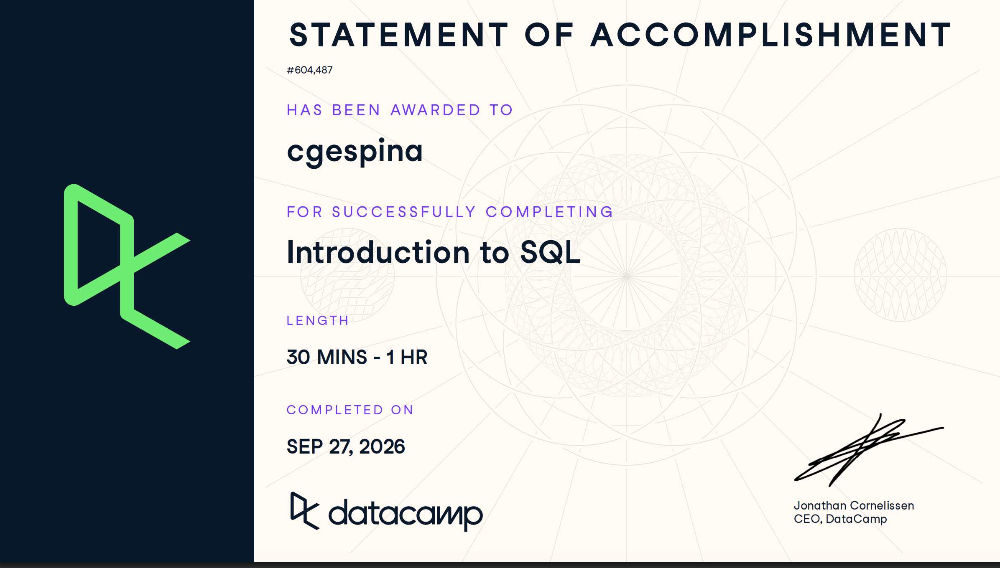

## Course-Completion Evidence



I began the Introduction to SQL course on Thursday, September 24, 2026, and completed it on September 26, 2026, as part of the IBM 6500 course requirements.

## Selecting Columns

### Main Ideas

This chapter introduced the basic structure of a relational database: data is organized into tables made up of rows and columns, where each column represents a specific type of information and each row represents a single record. The `SELECT` statement is the foundation for pulling data out of a table, and it can be used to return one specific column or several at once. I also learned how to give a column a more readable name in the output using `AS`, without changing the underlying data.

### Important SQL Syntax

- `SELECT` — pulls specified column(s) from a table
- `FROM` — specifies which table to pull from
- `AS` — renames (aliases) a column in the query result

### Example

```sql
SELECT customer_name AS name
FROM customers;
```

### Explanation of the Example

This query pulls the `customer_name` column from the `customers` table and renames it `name` in the output, using `AS`. The original column name in the table itself is unchanged — the alias only affects how it's labeled in the result.

### CEP Application

Being able to pull just one specific column, rather than an entire table, means I can isolate exactly the data I need — for example, pulling only customer emails or only campaign names from a much larger dataset. Renaming columns with `AS` also makes exported results easier to read and present in a marketing report.

## Filtering Rows

### Main Ideas

This chapter covers how to filter a table down to only the rows that meet certain criteria, using the `WHERE` clause combined with comparison operators, `AND`/`OR` to combine conditions, and `LIKE` for pattern matching in text. This was one of the chapters I found least intuitive in practice — I completed the exercises, but didn't end up applying `WHERE` filtering as much as `ORDER BY`, so it's a concept I want to review and practice more.

### Important SQL Syntax

- `WHERE` — filters rows based on a condition
- `=`, `<>`, `>`, `<`, `>=`, `<=` — comparison operators
- `AND`, `OR` — combine multiple conditions
- `LIKE` — matches a pattern in text (often with `%` as a wildcard)
- `IS NULL` / `IS NOT NULL` — checks for missing values

### Example

```sql
SELECT customer_name, city
FROM customers
WHERE city = 'Los Angeles';
```

### Explanation of the Example

This query returns only the customers whose `city` column equals `'Los Angeles'`, filtering out every other row in the table.

### CEP Application

`WHERE` filtering would let me narrow a large dataset down to a specific segment — for example, only customers in a certain region, only orders above a certain amount, or only survey responses from a specific date range — which is a core step in most marketing analytics work. This is a section I plan to revisit before using SQL for the CEP.

## Aggregate Functions

### Main Ideas

This chapter covers aggregate functions, which summarize an entire column of data into a single value (such as a total, average, or count), along with basic arithmetic in SQL and using `AS` to alias the result. This was the other chapter I found more challenging — I went through the lessons and exercises, but haven't yet used aggregate functions on my own outside the course, so it's another concept I want to practice further.

### Important SQL Syntax

- `COUNT()` — counts the number of rows
- `SUM()` — adds up the values in a column
- `AVG()` — calculates the average value in a column
- `MIN()` / `MAX()` — finds the smallest/largest value in a column
- `AS` — aliases the result of an aggregate calculation

### Example

```sql
SELECT AVG(order_total) AS avg_order_value
FROM orders;
```

### Explanation of the Example

This query calculates the average value across every row in the `order_total` column and labels the result `avg_order_value`.

### CEP Application

Aggregate functions would let me summarize marketing data at a glance — for example, calculating average order value, total campaign spend, or a count of survey responses — instead of having to review every row individually. This is another area I plan to strengthen before relying on it for the CEP.

## Sorting and Grouping

### Main Ideas

This chapter covered how to control the order that query results appear in, using `ORDER BY`. Results can be sorted in ascending order (`ASC`, the default, smallest/earliest first) or descending order (`DESC`, largest/latest first).

### Example

```sql
SELECT customer_name, signup_date
FROM customers
ORDER BY signup_date DESC;
```

### Important SQL Syntax

- `ORDER BY` — sorts the query result by a specified column
- `ASC` — sorts in ascending order (default if not specified)
- `DESC` — sorts in descending order

### Explanation of the Example

This query pulls each customer's name and signup date, then sorts the results by `signup_date` in descending order — so the most recently signed-up customers appear first.

### CEP Application

Sorting is useful for quickly surfacing the most relevant records in a marketing dataset — for example, ordering customers by most recent purchase date, or ranking campaigns by performance from highest to lowest.

## Overall Reflection and Future Reference

The most useful skills from this course were `SELECT` for pulling exactly the columns I need, `AS` for renaming results to be more readable, and `ORDER BY` for isolating and highlighting specific rows within a larger result set. The most challenging concepts were filtering rows with `WHERE` and using aggregate functions (`COUNT`, `SUM`, `AVG`) — I understand what they do conceptually, but haven't yet practiced applying them as much as the selecting and sorting commands. Looking ahead, SQL could support digital marketing work by making it possible to pull specific customer or campaign data, filter it down to a relevant segment, and summarize it into metrics like averages or totals — all of which are common needs in marketing analytics, customer insights, and survey research, and will likely come up in the CEP. Going forward, I expect to revisit `WHERE` filtering and the aggregate functions the most, since those are the areas I feel least confident with.

## Appendix: Publication Links

- [GitHub Repository](https://github.com/espinacecilia-design/ibm6500-assignments)
- [Published Introduction to SQL Report](https://espinacecilia-design.github.io/ibm6500-assignments/introduction-to-sql.html)
